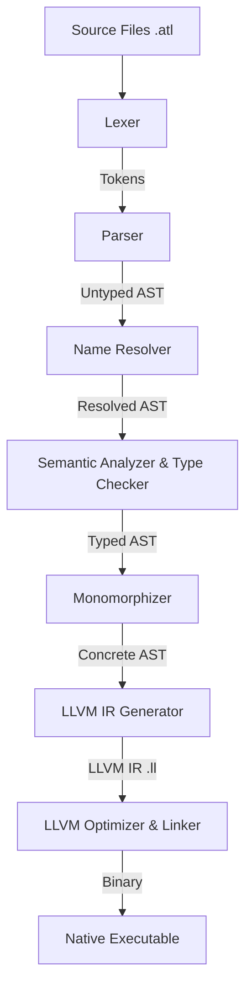

# Atlas Compiler Development Roadmap

This document outlines the architectural blueprint, testing infrastructure, directory layout, and phased implementation stages to develop the **Atlas** systems programming language.

The development is divided into distinct, incremental stages designed to maintain a working compiler at each step, utilizing **Rust** for the bootstrapping compiler (Atlas v0.1) targeting **LLVM IR** for native code generation.

---

## 1. Architectural Blueprint

The Atlas compiler uses a multi-pass pipeline. Each stage lowers the representation, ensuring separation of concerns and ease of debugging.



### Compiler Passes Details
1. **Lexical Analysis (Lexer)**: Translates UTF-8 source strings into a stream of structured tokens, removing comments and whitespace.
2. **Syntactic Analysis (Parser)**: Performs Pratt parsing for expressions and recursive descent for statements to construct an Untyped Abstract Syntax Tree (AST).
3. **Name Resolution**: Scopes and binds variable, function, and type identifiers. Prepares the AST for type inference.
4. **Semantic Analysis & Type Checking**: Checks static types, enforces explicit type conversions, validates nullable pointers (`@T?`) via flow analysis, and verifies class copy restrictions.
5. **Monomorphization Pass**: Detects generic references (e.g. `Array<T>`) and generates concrete instances of classes, choices, and functions based on their type parameters.
6. **LLVM IR Code Generation**: Lowers the concrete typed AST into LLVM IR (Intermediate Representation) using `llvm-sys` (LLVM C API bindings) or directly emitting text-based LLVM IR.
7. **Compilation & Linking**: Invokes `clang` or `lld` to optimize the generated LLVM IR, link with standard library compiled objects (FFI) and standard C runtime, producing the final executable.

---

## 2. Codebase Organization

The workspace is structured to support both the Rust bootstrap compiler and the Atlas standard library:

```
atlas/
├── Cargo.toml                 # Rust workspace configuration
├── compiler/                  # Bootstrapping compiler source in Rust
│   ├── Cargo.toml
│   └── src/
│       ├── main.rs            # CLI entry point (lang build ...)
│       ├── lexer.rs           # Lexical analysis
│       ├── parser.rs          # Parser and AST definitions
│       ├── resolver.rs        # Scoping and name binding
│       ├── typechecker.rs     # Static type system, flow analysis, constraints
│       ├── monomorphizer.rs   # Generic expansion pass
│       ├── llvm_codegen.rs    # LLVM IR generation
│       └── error.rs           # Diagnostic formatting
├── stdlib/                    # Standard Library source in Atlas
│   ├── memory.atl             # RAII heap allocators (malloc/free wrappers)
│   ├── io.atl                 # Basic console I/O
│   ├── string.atl             # Core String class
│   ├── array.atl              # Generic dynamic Array<T>
│   └── result.atl             # Standard choice Result<T, E>
└── tests/                     # Test Suites
    ├── snapshot/              # Token and AST structure expectations
    ├── diagnostics/           # Invalid programs checking compilation errors
    └── integration/           # End-to-end program execution checks
```

---

## 3. Testing System

To guarantee compiler stability and prevent regressions, the testing system will execute automatically in three distinct layers:

### A. Snapshot Testing (Unit level)
- Checks the structure of Lexer tokens and AST nodes.
- Expected outputs are saved as `.snap` files. Any deviation flags a test failure.
- **Tools**: Rust `insta` crate for managing snapshot updates.

### B. Compile-fail / Diagnostics Testing (Type checker level)
- Tests that incorrect Atlas code generates clear, precise errors from the compiler.
- Each test file contains comments indicating the expected error code and message.
- **Example test case (`tests/diagnostics/copy_class.atl`):**
  ```atlas
  // error: Class 'File' cannot be copied. Use explicit references '@' or clone()
  var a = File("test.txt");
  var b = a; 
  ```

### C. End-to-End Integration Testing (Backend level)
- Compiles real Atlas programs, executes the binary, and checks the output (standard output, error output, and exit status).
- **Test harness runner**: A custom Rust test runner that builds the test files, runs the executable, and matches outputs defined in header comments.
  ```atlas
  // test: execution
  // stdout: Hello World!
  // exit: 0
  import io;
  fn main(): int {
      io::println("Hello World!");
      return 0;
  }
  ```

---

## 4. Phased Development Stages

### Stage 1: Basic Tokenization and Parsing
*Goal*: Read source files, produce a token stream, and construct a basic AST for expressions and variables.

*   **Compiler Scope**:
    *   **Lexer**: Recognize whitespace, line/multi-line comments, identifiers, keywords (`var`, `const`, `fn`, `bool`, `and`, `or`, `not`), primitive literals (integers, reals, booleans, characters, string literals).
    *   **Parser**: Implement recursive descent for statements and Pratt parsing for expression priorities.
    *   **AST**: Structs for expressions (literals, variable references, arithmetic/comparison/boolean operations).
*   **Standard Library Scope**: None.
*   **Testing**:
    *   Snapshot tests of token streams and parsed ASTs for arithmetic expressions.

---

### Stage 2: Code Generation and Control Flow
*Goal*: Translate simple Atlas programs into executable LLVM IR binaries with basic execution flow.

*   **Compiler Scope**:
    *   **LLVM IR Code Generation**: Define basic types (int, uint, float, bool, char). Emit target triples and function headers.
    *   **Control Flow**: Support compilation of conditionals (`if`, `else if`, `else`) and loops (`while`).
    *   **Functions**: Generate function definitions and calls (parameters, return types).
*   **Standard Library Scope**:
    *   Minimal runtime linking: support a test module calling standard C functions (e.g. FFI to `putchar` or `printf` for diagnostics).
*   **Testing**:
    *   Integration tests validating exit codes of basic arithmetic/logical expressions.
    *   Loop and conditional branch correctness validation.

---

### Stage 3: Structs and Pointers
*Goal*: Implement stack-allocated pure data aggregates and memory address references.

#### Proposed Changes

##### 1. Parser & AST Extensions
- **AST Nodes**:
  - Add `Item::StructDecl(StructDecl)` where:
    ```rust
    pub struct StructDecl {
        pub name: (String, Span),
        pub fields: Vec<((String, Span), TypeExpr)>,
        pub span: Span,
    }
    ```
  - Add `TypeExpr::Pointer { target: Box<TypeExpr>, nullable: bool, span: Span }` to represent pointer type annotations like `@int32` or `@File?`.
  - Add `Expr::StructInit` to represent named struct instantiation:
    ```rust
    StructInit {
        struct_name: (String, Span),
        fields: Vec<((String, Span), Expr)>,
        span: Span,
    }
    ```
  - Add `Expr::MemberAccess` to represent field access:
    ```rust
    MemberAccess {
        object: Box<Expr>,
        member: (String, Span),
        span: Span,
    }
    ```
  - Add unary operator cases: `UnaryOp::AddressOf` (for `@`) and `UnaryOp::Dereference` (for `*`).
- **Parsing Rules**:
  - Parse `struct` declarations at top level: `struct Name { name: Type, ... }`.
  - Handle prefix operators `@` and `*` in expression parser.
  - Implement suffix/infix `.` member access in Pratt parser (high precedence).
  - Implement struct instantiation parser rule: when an identifier is followed by `{`, parse it as a struct initializer list rather than a block or expression.

##### 2. Type Checker & Resolver
- **Type Representation**:
  - Extend `AtlasType` with:
    - `AtlasType::Struct(String)`
    - `AtlasType::Pointer { target: Box<AtlasType>, nullable: bool }`
- **Resolution**:
  - Module-level register pass for all defined structs, mapping each struct name to its list of fields and types.
  - Add recursive definition check: trace struct layout dependencies (via non-pointer fields) to detect cycles and emit diagnostic `TypeError` if a struct directly or transitively contains itself.
  - Resolve pointer types (e.g. `@int32` resolves to `AtlasType::Pointer`).
- **Type Checking Rules**:
  - Address-of `@expr`: check that `expr` is an addressable location (L-value). The resulting type is `AtlasType::Pointer` to the operand's type.
  - Dereference `*expr`: check that `expr` has a pointer type. The resulting type is the pointer's target type.
  - Struct initialization `StructName { f1: v1, ... }`: check that the struct exists, all declared fields are supplied exactly once, and each initializer type matches the field's declared type.
  - Member access `obj.member`: check that `obj` is of a struct type (strictly require explicit dereference `(*p).member` if `p` is a pointer). Resolve to the type of the field `member`.

##### 3. LLVM IR Code Generation
- **Type Mapping**:
  - Map `AtlasType::Struct` to LLVM struct type name: `%struct.Name`.
  - Map `AtlasType::Pointer` to LLVM pointer type: `ptr` (using LLVM's opaque pointer type) or `<target>*`.
  - Define struct type declarations at the beginning of the IR output: `%struct.Name = type { type1, type2, ... }`. Keep a map of field names to their indices in the struct definition.
- **L-Value vs R-Value Codegen**:
  - Separate value generation (`gen_expr`) from address generation (`gen_lvalue_addr`).
  - An L-value can be a variable reference, member access, or pointer dereference.
  - `gen_lvalue_addr` returns the memory address (LLVM pointer value) of the L-value:
    - Variable `x`: returns the alloca register `%x.addr.X`.
    - Member access `obj.member`: calls `gen_lvalue_addr` on `obj` to get its base address, then emits `getelementptr` using the base struct type and the field's index.
    - Dereference `*ptr`: evaluates `ptr` to get its pointer value.
  - `gen_expr` for L-values calls `gen_lvalue_addr` followed by a `load` instruction.
- **CodeGen Rules**:
  - Address-of `@expr`: calls `gen_lvalue_addr` on `expr` and returns the address register.
  - Struct initialization: allocates a temporary struct register via `alloca`, then uses `getelementptr` and `store` to populate each field's value, returning the loaded/copied struct value or reference.

#### Execution Checklist

- [ ] **AST & Parser**:
  - [ ] Add `StructDecl` item variant to `Item` in `parser.rs`.
  - [ ] Add `Pointer` type variant to `TypeExpr`.
  - [ ] Add `StructInit` and `MemberAccess` variants to `Expr`.
  - [ ] Add `AddressOf` and `Dereference` to `UnaryOp`.
  - [ ] Implement parser for `struct` declarations.
  - [ ] Implement parser for member access and struct initialization.
  - [ ] Write parser snapshot tests.
- [ ] **Type Checker**:
  - [ ] Register struct fields in environment pass.
  - [ ] Implement cycle detection for recursive struct definition check.
  - [ ] Implement typecheck rules for `@`, `*`, `.`, and struct initializations.
  - [ ] Write compile-fail diagnostics tests for recursive structs and invalid assignments.
- [ ] **Codegen**:
  - [ ] Emit `%struct.Name = type { ... }` at the top of the LLVM IR module.
  - [ ] Implement `gen_lvalue_addr` in `llvm_codegen.rs`.
  - [ ] Implement codegen for address-of, dereference, member access, and struct initialization.
- [ ] **Verification**:
  - [ ] Create integration tests validating stack allocation, field modification, nested struct access, and pointer operations.
  - [ ] Ensure all workspace tests pass and clippy has zero warnings.

---

### Stage 4: Classes and RAII Lifetimes
*Goal*: Introduce encapsulation, methods, and automatic scope-based resource management (RAII).

*   **Compiler Scope**:
    *   **Classes**: Parser and Semantic rules for class declarations, member methods (handling implicit `self` pointer as `@ClassName` or value copy if specified), and visibility modifiers (`public` vs `private` by default).
    *   **Lifetime Management**: Inject implicit destructor calls (`destroy()`) at scope exits. If a class contains another class instance, invoke its destructor in reverse declaration order.
    *   **Copy Prevention**: Enforce semantic analyzer error when classes are copied with `=`. Require reference `@` or explicit `.clone()` method call.
*   **Standard Library Scope**:
    *   **`memory` Module**: Initial implementation (`stdlib/memory.atl`). Contains declarations for C `malloc` and `free` via `extern "C"`.
    *   Expose `memory::new<T>()` which allocates `T` on the heap, returns `@T`, and registers it to automatically call `destroy()` on scoping rules.
*   **Testing**:
    *   Verify class copy errors in compile-fail tests.
    *   Integration tests verifying heap allocations and that `destroy()` is called exactly when the owner scope terminates.

---

### Stage 5: Fixed Arrays, Slices, and Strings
*Goal*: Add sequence data types and map text literals to the standard library String structure.

*   **Compiler Scope**:
    *   **Fixed Arrays**: Stack-allocated or field-inline fixed-size arrays (`T[N]`), sizing part of type context.
    *   **Slices**: Internally represent slices (`[]T`) as a struct containing `ptr: @T` and `len: uint`. Auto-coerce fixed arrays to slices when passing to functions.
    *   **String Literal Parsing**: Map raw string literals (compiled as raw `char[N]`) to the standard `String` type automatically depending on context.
*   **Standard Library Scope**:
    *   **`string.atl`**: Core implementation of `String` using dynamic memory, exposing `String::from(chars: char[])` and `length()`.
*   **Testing**:
    *   Verify array/slice indexing bounds constraints.
    *   Execution tests validating string literal conversion to standard `String` objects.

---

### Stage 6: Enums, Choices, Match, and Nullability
*Goal*: Implement algebraic sum types, exhaustive pattern matching, and null-safe pointer flow.

*   **Compiler Scope**:
    *   **Enums**: Define named integer constants (e.g., `Color::Red`).
    *   **Choices**: Support sum types containing variants with distinct associated data types.
    *   **Exhaustive Matching**: Implement exhaustive checking for `match` blocks over Enums and Choices. Uncovered paths must fail compilation unless a default case `_` is specified.
    *   **Nullable Pointers**: Add nullable pointers (`@T?`). The compiler performs flow analysis: inside an `if file != null` check, the compiler automatically treats `file` as non-nullable `@T`. Any dereference of a nullable pointer outside such checks generates an error.
    *   **Error Operator**: Error propagation `?` operator. Lowers to automatic match-unwrap returning the error variant.
*   **Standard Library Scope**:
    *   **`result.atl`**: Define `choice Result<T, E> { Ok(T), Error(E) }`.
*   **Testing**:
    *   Compile-fail tests checking match exhaustiveness and unsafe nullable pointer dereferences.
    *   E2E tests executing `?` operator propagation flows.

---

### Stage 7: Generics and Constraints
*Goal*: Enable parametric polymorphism with zero-overhead runtime monomorphization and structural constraints.

#### Proposed Changes

##### 1. Parser & AST Extensions
- **AST Nodes**:
  - Extend `ClassDecl` to include generic parameters:
    ```rust
    pub struct ClassDecl {
        pub name: Spanned<String>,
        pub generic_params: Vec<Spanned<String>>,
        pub fields: Vec<ClassField>,
        pub methods: Vec<ClassMethod>,
        pub span: Span,
    }
    ```
  - Extend `FunctionDecl` to include generic parameters and `where` constraints:
    ```rust
    pub struct FunctionDecl {
        pub name: Spanned<String>,
        pub generic_params: Vec<Spanned<String>>,
        pub params: Vec<Param>,
        pub ret_ty: Option<Spanned<TypeExpr>>,
        pub where_clauses: Vec<WhereClause>,
        pub body: Block,
    }
    ```
  - Add `WhereClause` and `ConstraintSignature` representations to the AST:
    ```rust
    pub struct WhereClause {
        pub target: Spanned<String>, // e.g. T
        pub constraints: Vec<ConstraintSignature>,
        pub span: Span,
    }
    pub struct ConstraintSignature {
        pub name: Spanned<String>,
        pub params: Vec<Param>,
        pub ret_ty: Option<Spanned<TypeExpr>>,
        pub span: Span,
    }
    ```
- **Parsing Rules**:
  - Parse optional generic type lists `<T1, T2>` following function and class identifiers.
  - Parse `where TypeName ( fn name(self, ...): Ret; ... )` structural constraint blocks following function parameter lists and return types.

##### 2. Name Resolution & Semantic Analysis
- **Generic Definition Templates**:
  - Register generic class and function AST definitions as un-instantiated templates.
  - Delay type checking of generic bodies until monomorphization with concrete type parameters is triggered.
- **Monomorphization Pass**:
  - Scan AST for generic type instantiations (e.g. `Array<int>` or `Result<int, int>`).
  - Perform type substitution (replace generic placeholders like `T` with concrete types like `int`).
  - Create and register concrete instances of classes, structs, choices, and functions with uniquely mangled names (e.g. `Array_int`) in the typechecker scope.
- **Constraint Validation**:
  - For each monomorphized instance, inspect the methods implemented by the concrete type.
  - Verify that the type defines all methods specified in the matching generic `where` constraints with compatible signatures.
  - Generate compiler errors indicating exactly which constraint method signatures are missing or mismatched.

##### 3. LLVM IR Code Generation
- **Mangled Types & Functions**:
  - Lower monomorphized class/struct/choice types to uniquely mangled LLVM types (e.g., `%class.Array_int`).
  - Emit code for monomorphized method and function instances.
  - Resolve call expressions to reference the mangled LLVM function names.

#### Execution Checklist

- [ ] **AST & Parser**:
  - [ ] Add `generic_params` to `ClassDecl` and `FunctionDecl`.
  - [ ] Implement `WhereClause` and `ConstraintSignature` AST structures.
  - [ ] Parse optional generic parameters `<...>` on classes and functions.
  - [ ] Parse `where` constraints on generic function declarations.
  - [ ] Write parser snapshot tests.
- [ ] **Resolver & Type Checker**:
  - [ ] Implement template registration for generic structures.
  - [ ] Design monomorphization engine substituting generic placeholders.
  - [ ] Implement structural constraint checking on concrete types.
  - [ ] Write compile-fail tests for missing constraint methods.
- [ ] **Codegen**:
  - [ ] Support generating LLVM types and methods for monomorphized instances.
- [ ] **Standard Library & Verification**:
  - [ ] Implement `stdlib/array.atl` containing generic `Array<T>`.
  - [ ] Write integration tests for generic functions and multiple generic structures.

---

### Stage 8: Modules, Namespaces, and the Build System
*Goal*: Construct module structures, namespaces, and standard compilation tools for multi-file projects.

#### Proposed Changes

##### 1. Parser & AST Extensions
- **AST Nodes**:
  - Update `Item` to track export status:
    ```rust
    pub enum Item {
        FunctionDecl(FunctionDecl, bool),
        ExternFnDecl(ExternFnDecl, bool),
        StructDecl(StructDecl, bool),
        ClassDecl(ClassDecl, bool),
        EnumDecl(EnumDecl, bool),
        ChoiceDecl(ChoiceDecl, bool),
        Import(Spanned<String>),
    }
    ```
- **Parsing Rules**:
  - Store export status on parsed items by matching the optional prefix keyword `export`.
  - Parse type expressions containing module namespace separators (`module::Type`) and store them in `TypeExpr::Named` as qualified strings (e.g. `"module::Type"`).
  - Generalize expressions like `module::Name` or `module::class::method` to support nested namespace lookups.

##### 2. Scoping & Type Checker
- **Module Interface**:
  - Design a `ModuleInterface` struct containing exported declarations and signatures for a parsed file.
  - Implement a recursive/topological build pipeline to parse transitively imported modules.
- **Scoping**:
  - Limit type and function lookups to the local scope and imported module interfaces.
  - Prefix resolved symbols and type definitions with module names (e.g. `module.Name`) to generate unique, clash-free LLVM symbols.
  - Enforce access control checking: raise type/resolver errors if a module attempts to import or call private/un-exported items of another module.

##### 3. Build System & CLI
- **Optional CLI Argument**:
  - Change `atlas build` target file to be optional. If not provided, search for a `package.atl` config file in the current directory and read its `entry` path.
- **Standard Library search**:
  - Package standard library components under `./stdlib/` and resolve them automatically when imported.

#### Execution Checklist

- [ ] **AST & Parser**:
  - [ ] Update `Item` to track export status.
  - [ ] Implement parsing of `export` prefix for items.
  - [ ] Implement namespace type and expression parsing (`::`).
- [ ] **Resolver & Type Checker**:
  - [ ] Implement topological sorting / dependency resolution for imported files.
  - [ ] Track global modules map and module-level imports.
  - [ ] Implement exported visibility access checks.
  - [ ] Apply namespace prefixing to resolved type names and function symbols.
- [ ] **CLI & Codegen**:
  - [ ] Add `package.atl` configuration parser and CLI fallback.
  - [ ] Generalize LLVM codegen for namespace-prefixed symbols.
- [ ] **Verification**:
  - [ ] Add multi-file integration tests for imports, exports, and namespaces.
  - [ ] Add diagnostics verification tests for access control and circular imports.

---

### Stage 9: Bootstrapping and Self-Hosting
*Goal*: Re-implement the compiler in Atlas itself and achieve compiler self-hosting.

*   **Compiler Scope**:
    *   Add production compiler optimizations.
    *   Ensure error diagnostics are fully mature.
*   **Standard Library Scope**:
    *   Ensure all necessary files, strings, lists, hash maps, and file system libraries are feature-complete.
*   **Execution Strategy**:
    1.  **Compiler v0.1 (Rust)**: Fully compile the Atlas codebase written in Atlas to produce an executable, `atlas_v1_bin`.
    2.  **Compiler v1.0 (Atlas-compiled)**: Run `atlas_v1_bin` to compile the Atlas compiler codebase again, producing `atlas_v2_bin`.
    3.  **Validation**: Verify that `atlas_v1_bin` and `atlas_v2_bin` generate identical binary outputs for any given input (verifying compiler stability).
